# Escola Superior de Tecnologia de Setúbal 

### Inteligência Artificial - 2020/2021


# Manual de utilizador

### Projeto Nº 2: Problema do Quatro 

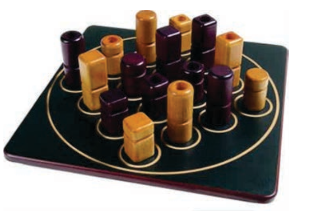

**Realizado por**

| Numero    | Nome              | Ano  |
| --------- | ----------------- | ---- |
| 200600485 | Danilson Sanches  | 3º   |


**Docentes** 

- Prof. Joaquim Felipe
- Eng. Filipe Mariano


<div style="page-break-after: always;"></div> 

## 1. Descrição do problema do Quatro

Este projeto destina-se a resolver o problema baseado no jogo do Quatro, este jogo é constituído por um tabuleiro de 4X4 casas e um conjunto de peças (até 16 dependente dos problemas) que possuem traços característicos de forma e de cor em que existem peças brancas ou pretas, parte delas são altas, a outra parte são baixas, umas são quadradas outras são redondas. 

Algumas peças são cheias outras são ocas, deixando para a secção seguinte a explicação do que se pretende que seja desenvolvido no projeto de Inteligência Artificial relativo à resolução de um problema neste contexto por procura em Espaço de Estados e o objetivo é encontrar para um determinado tabuleiro, qual a solução óptima ou de menor custo para chegar o fim do jogo e para isso,  é preciso completar uma linha de 4 peças (na horizontal, na vertical ou na diagonal) que compartilhem pelo menos um traço em comum (4 peças pretas, ou 4 peças altas, ou 4 peças ocas, etc).

## 2. Como iniciar à aplicação

Para iniciar a aplicação necessita de abrir o ficheiro ***interact.lisp*** no IDE LispWorks. Uma vez aberto deverá estar à semelhança da seguinte figura 1.

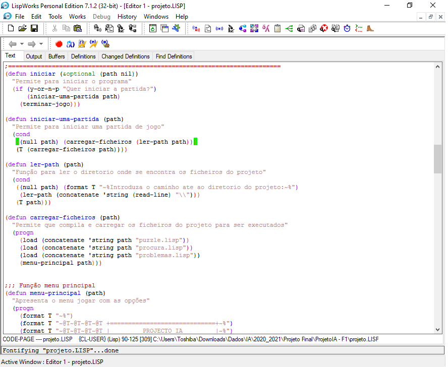

De modo a que consiga iniciar a aplicação, tem que primeiro compilar as suas funções, para isso carregue no botão 

e uma vez compilado deverá abrir a semelhança da figura 2 e para sair, só precisa clicar no espaço do teclado. 

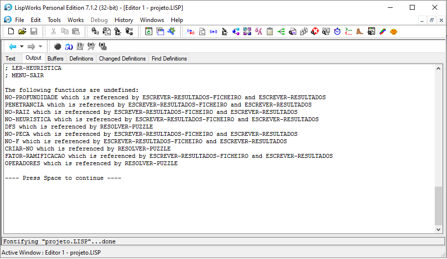

E depois é só abrir o **Listener** para começar a simular o jogo, uma vez aberto, deverá aparecer a semelhança da figura 3. 

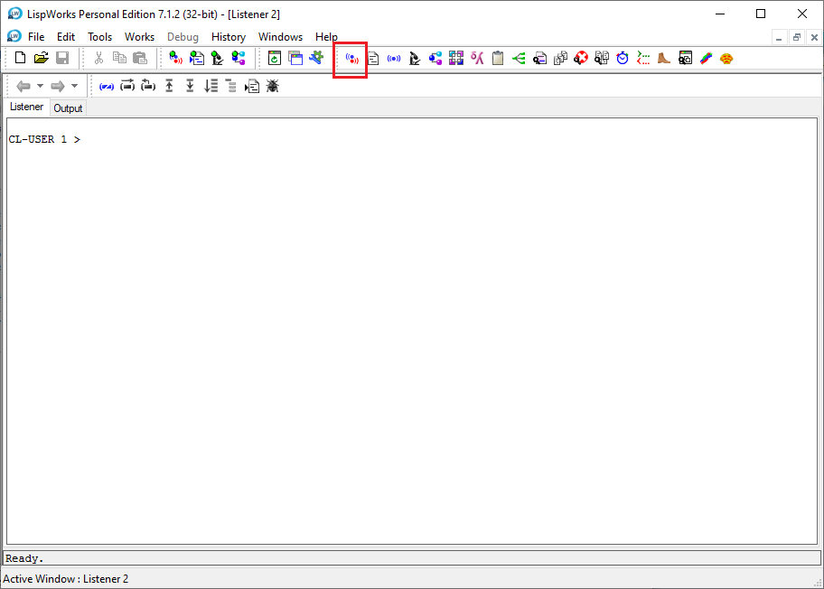

Agora está tudo pronto para iniciar a aplicação, no painel da Listener executa a função **(iniciar)** e de seguida irá pedir para escolher **sim** para iniciar uma partida ou **não** para terminar o programa, como mostra a figura 4.

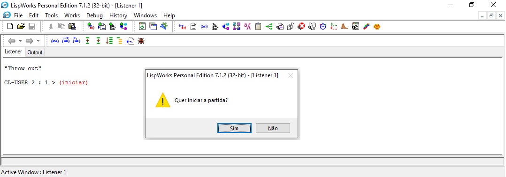

Depois de clicar ***Sim***, irá ser pedido inserir o caminho para a diretoria principal da aplicação, como mostra a figura 5 e depois carregue na tecla ***Enter*** do teclado.

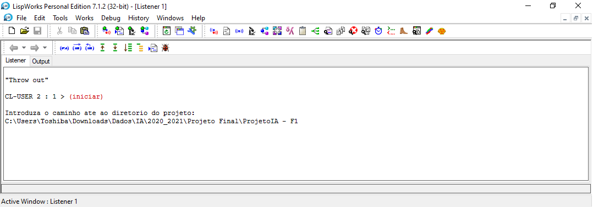

Irá ver que a aplicação irá carregar os ficheiros ***jogo.lisp*** e  ***algoritmo.lisp*** com sucesso e de seguida apresenta o menu principal onde poderá utilizar à aplicação, a semelhança da figura 6.

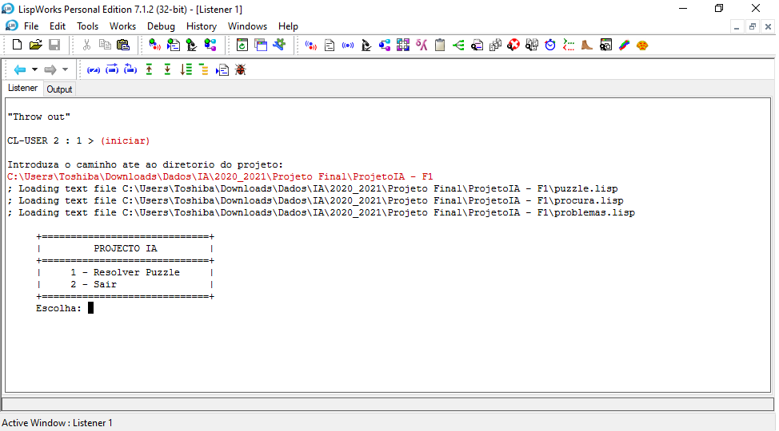

Neste menu principal, pode escolher uma de duas opções:

1. **Menu Iniciar jogo**

   Esta opção dará início à aplicação, levando-lhe para outros menus onde tem a possibilidade de escolher qual o **tipo de jogo** que deseja,  e no início de cada partida, o utilizador deve decidir quem começa, **humano** ou **computador**, e qual o **tempo limite** para o computador jogar, o qual será de X milissegundos e tendo como objetivo encontrar a jogada do jogador computador através da aplicação do algoritmo de jogo, o **AlfaBeta** **com cortes alfa‒beta**, como mostra a figura 7.

   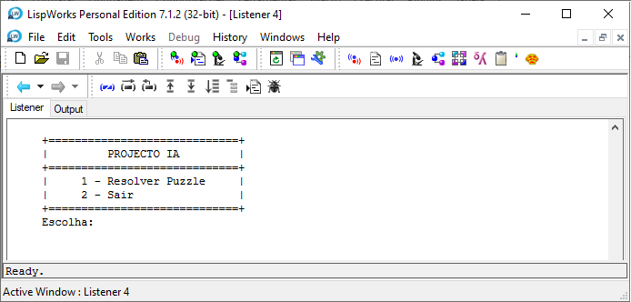

2. **Menu Sair**

   Como pode deduzir, esta opção leva ao término da aplicação, parando a sua execução, como mostra a figura 8.

   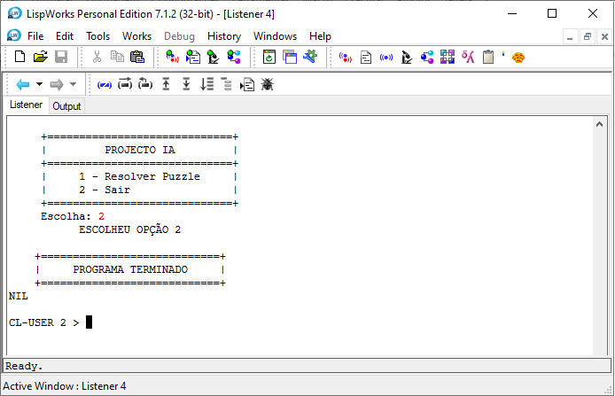

E se pretender iniciar novamente a aplicação é somente, seguir o mesmo procedimento já descrito na seção como iniciar a aplicação, escrevendo a função **(iniciar)** no Listener, como mostra a figura 9. 


## 3. Iniciar o jogo

Escolhendo a opção 1 para **iniciar o jogo** a aplicação irá mostrar outros menus onde irá escolher o tipo de jogo, como **humano vs computador** e **computador vs computador**, como mostra a figura 10.


Para cada tipo de jogo escolhido é sempre iniciado com um tabuleiro vazio que contém uma reserva de 16 peças, como mostra a figura 11 e figura 12.

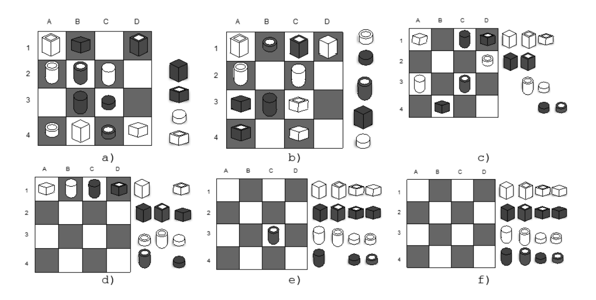

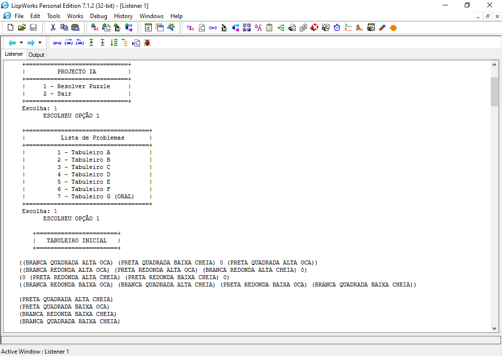

## 3.1 - Humano vs Computador

Após a escolha do jogo **humano vs computador**, o utilizador deve decidir quem começa, **humano** ou **computador** e qual o tempo limite para o computador jogar, o qual será de X milissegundos. O valor de X deverá ser um valor compreendido entre **1000** e **5000** milissegundos, como mostra a figura 13.

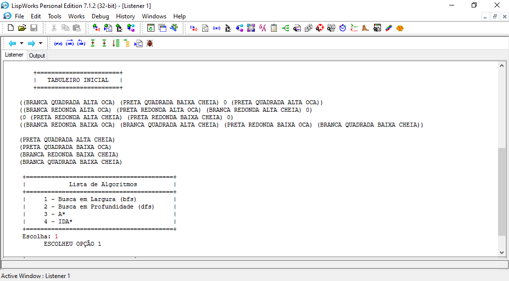

Depois de escolher o **jogador Humano** para iniciar o jogo e  inserir o tempo limite do computador, o jogo vai iniciar e vai pedir ao **jogador Humano** para realizar a sua jogada com a peça disponivel como mostra a figura 14.

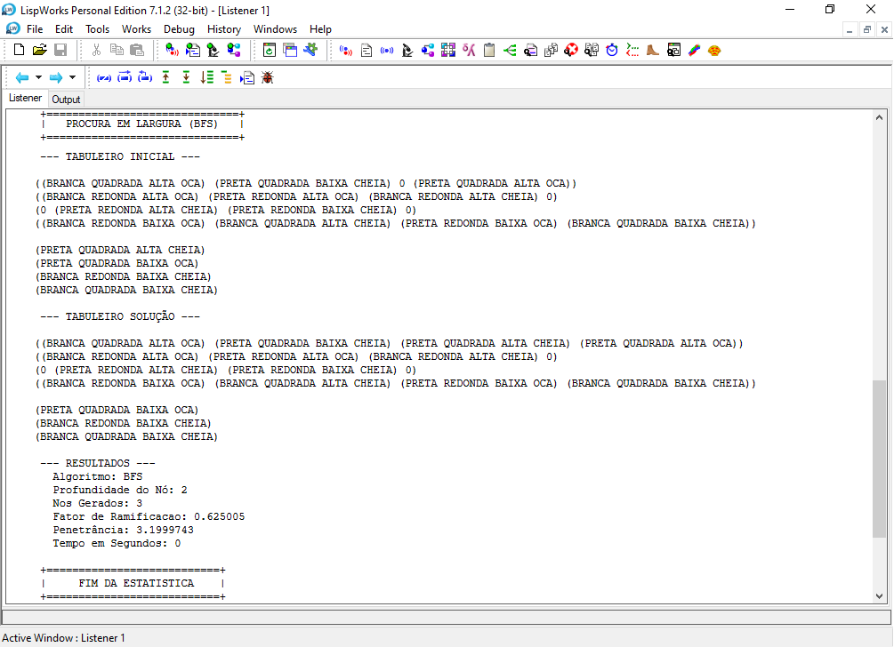

O **jogador Humano** ao realizar a sua jogada, deverá validar se a jogada é  válida e se não for irá receber algumas mensagens de erro, como mostra a figura 15.


Depois do **jogador Humano** realizar a sua jogada válida, irá passar a vez para outro jogador que será o **computador**, como mostra a figura 16.


 A jogada do **jogador Computador** é encontrada através da aplicação do algoritmo de jogo, o AlfaBeta com cortes alfa‒beta, como o seguinte resultado.

```
     +======================+
​    |     ESTATISTICA      |
​    +======================+

Jogada: ((((BRANCA REDONDA ALTA OCA) 0 0 0) (0 0 0 (PRETA REDONDA ALTA OCA)) (0 0 0 0) (0 0 0 0)) ((BRANCA REDONDA BAIXA OCA) (PRETA REDONDA BAIXA OCA) (BRANCA QUADRADA ALTA OCA) (PRETA QUADRADA ALTA OCA) (BRANCA QUADRADA BAIXA OCA) (PRETA QUADRADA BAIXA OCA) (BRANCA REDONDA ALTA CHEIA) (PRETA REDONDA ALTA CHEIA) (BRANCA REDONDA BAIXA CHEIA) (PRETA REDONDA BAIXA CHEIA) (BRANCA QUADRADA ALTA CHEIA) (PRETA QUADRADA ALTA CHEIA) (BRANCA QUADRADA BAIXA CHEIA) (PRETA QUADRADA BAIXA CHEIA)) 2 1 1 ((((BRANCA REDONDA ALTA OCA) 0 0 0) (0 0 0 0) (0 0 0 0) (0 0 0 0)) ((PRETA REDONDA ALTA OCA) (BRANCA REDONDA BAIXA OCA) (PRETA REDONDA BAIXA OCA) (BRANCA QUADRADA ALTA OCA) (PRETA QUADRADA ALTA OCA) (BRANCA QUADRADA BAIXA OCA) (PRETA QUADRADA BAIXA OCA) (BRANCA REDONDA ALTA CHEIA) (PRETA REDONDA ALTA CHEIA) (BRANCA REDONDA BAIXA CHEIA) (PRETA REDONDA BAIXA CHEIA) (BRANCA QUADRADA ALTA CHEIA) (PRETA QUADRADA ALTA CHEIA) (BRANCA QUADRADA BAIXA CHEIA) (PRETA QUADRADA BAIXA CHEIA)) 2 0 0 NIL)) 
Valor de Alfa-Beta: -100 
Cortes Alfa: 476
Cortes Beta: 145
Nos Analisados: 1341
Tempo Gasto: 3
```

Depois do computador realizar a sua jogada final, irá passar para vez do **jogador Humano** até chegar o fim do jogo e encontrar um vencedor ou se houve empate, como mostra a figura 17.


Para determinar um vencedor, utilizar a mesma função **(solucaop)**  do projeto da fase 1 e para isso,  é preciso completar uma linha de 4 peças (na horizontal, na vertical ou na diagonal) que compartilhem pelo menos um traço em comum (4 peças pretas, ou 4 peças altas, ou 4 peças ocas), como mostra a figura 18.


Quando não há mais peças de reserva e o tabuleiro estiver cheio e no caso houver não vencedor, será declarado empate, como mostra a figura 19.


## 3.2 - Computador vs Computador

Após a escolha do jogo **computador vs computador**, o utilizador deve inserir qual o tempo limite para o computador jogar, o qual será de X milissegundos. O valor de X deverá ser um valor compreendido entre **1000** e **5000** milissegundos, como mostra a figura 20.


Depois de inserir o tempo limite para jogada de cada computador, o jogo vai iniciar e mostrar a **jogador computador-1**, como mostra a figura 21.

E depois do **jogador computador-1** realizar a sua jogada e ser avaliada, irá passar para o proximo jogador a jogar que será o **jogador computador-2** até o jogo terminar, como mostra a figura 22.


Para determinar um vencedor, utilizar a mesma função **(solucaop)**  do projeto da fase 1 e para isso,  é preciso completar uma linha de 4 peças (na horizontal, na vertical ou na diagonal) que compartilhem pelo menos um traço em comum (4 peças pretas, ou 4 peças altas, ou 4 peças ocas), como mostra a figura 23.


Quando não há mais peças de reserva e o tabuleiro estiver cheio e no caso houver não vencedor, será declarado empate, como mostra a figura 24.


##  4. Gravar avaliação do alfabeta no ficheiro

Foi efetuada uma análise estatística acerca de uma execução do programa contra um adversário humano, mencionando o limite de tempo usado e, para cada jogada: o respetivo valor, a profundidade do grafo de jogo e o número de cortes efetuado no processo de análise no ficheiro **log.dat**, como mostra a figura 25.

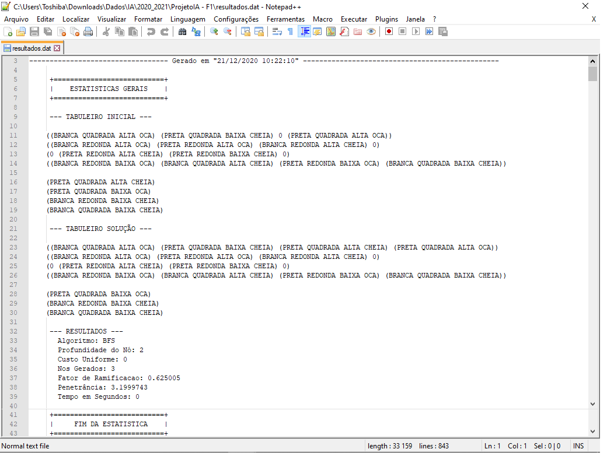

## 5. Limitações do programa

Nesta fase, como não tivemos nenhum erro na utilização da aplicação, concluímos que não existe limitação no programa, sendo que conseguimos resolver todas as anomalias que impediam o funcionamento do programa.